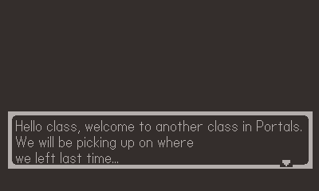
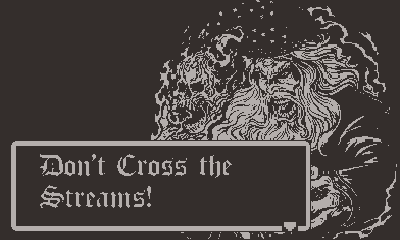

# Don't Cross the Streams 🧙‍♂️🌀

This game was developed for the fith edition of the [Retro Jam](https://itch.io/jam/retro-jam-2022/entries) event organized by the *IEEE University of Porto Student Branch*.

It was developed during a 48-hour period for the [Playdate](https://play.date/) console.

**Theme:** Entanglement

## Awards 🏆

- **Best game** - 2nd winner

## Controls 🎮

- **Arrows** - Move character
- **S** - Interact

## Team 👥

- **Bárbara Pinto** ([@MadDinosaur](https://github.com/MadDinosaur)) - Code 💻
- **Cristovão Sampaio** ([@Sakkris](https://github.com/Sakkris)) - Art 🎨
- **Eduardo Correia** ([@Educorreia932](https://github.com/Educorreia932)) - Code 💻
- **Xavier Santos** ([@xavier-santos](https://github.com/xavier-santos)) - Music 🎹

## Install instructions

The [Playdate SDK](https://play.date/dev/) is needed in order to run the game, so install it first if you haven't yet.
